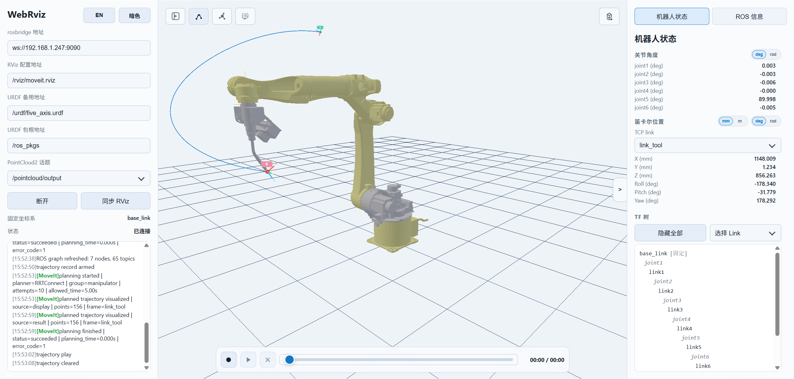

# WebRviz 本地可视化工具
[](.github/workflows/ci.yml)
[](LICENSE)


## 项目简介

`WebRviz` 是一个运行在本地浏览器中的轻量级可视化工具，目标是将网页端显示与 `RViz` 的核心数据保持同步，并支持后续嵌入 Qt 界面。

---

## 功能特性

- 在网页中显示机器人 URDF 模型，并同步渲染 `/tf`、`/tf_static`、`/joint_states`、`sensor_msgs/PointCloud2`。
- 支持一键同步 RViz 配置，包括固定坐标系与点云候选话题。
- 左侧面板支持中英文切换、亮色/暗色主题切换，以及自适应布局。
- 右侧 `Robot State` 面板包含关节角度、笛卡尔位置、TF 树；TF 树会显示 `link -> joint -> link` 层级，并支持点击查看 link / joint 详情。
- 右侧 `ROS Info` 面板支持浏览 topic、service、param 列表，并查看消息、服务和参数详情。
- 中间 3D 视图支持按需显示全部 / 隐藏全部 / 选择指定 Link 的 TF 坐标轴，并提供重置视角按钮。
- 支持 MoveIt 规划轨迹预览，可显示轨迹线以及 TCP 起点 / 终点姿态标记。
- 支持 `ROS 图谱` 弹窗，基于 `rosapi` 的 nodes / node_details 快照显示 `Nodes/Topics (all)` 详细关系图，并可切换为节点通信关系图。
- 支持 `运动曲线` 弹窗，基于 `/move_group/result` 中的 `trajectory_msgs/JointTrajectoryPoint[]` 绘制关节位置、TCP、速度、加速度与力矩曲线，并支持单位切换与悬停读数。
- 轨迹录制与回放支持暂停、进度拖动、时间显示与回放预览。
- 左下角日志框会记录连接、同步、轨迹操作，并单独输出 MoveIt 规划与执行状态。
- 本地部署，资源占用较低，适合嵌入桌面端或局域网使用。



---

## 环境要求

### 系统与中间件

- Ubuntu 20.04
- ROS Noetic
- MoveIt1

### 工具链

- Python 3.8+
- Node.js 18+（推荐 Node.js 20 LTS）
- npm

### ROS 组件

- `rosbridge_server`
- `rosapi`

可用以下命令检查：

```bash
rosservice list | grep /rosapi
```

建议至少包含：

- `/rosapi/topics`
- `/rosapi/topic_type`
- `/rosapi/get_param`
- `/rosapi/nodes`
- `/rosapi/node_details`

---

## 快速开始

### 1. 从源码构建

#### 1.1 从仓库拉取代码并安装前端依赖

```bash
git clone https://github.com/shine-tong/WebRviz.git
cd ~/WebRviz/web_rviz
npm install
```

#### 1.2 启动 ROS 与 MoveIt

```bash
source ~/your_ws/devel/setup.bash
roslaunch your_moveit_config demo.launch
```

另开终端启动 rosbridge：

```bash
source ~/your_ws/devel/setup.bash
roslaunch rosbridge_server rosbridge_websocket.launch
```

也可以直接在 `demo.launch` 中加入 `rosbridge` 与 `rosapi`：

```xml
<!-- Start rosbridge websocket server -->
<node pkg="rosbridge_server"
      type="rosbridge_websocket"
      name="rosbridge_websocket"
      output="screen">
  <param name="port" value="9090"/>
</node>

<!-- rosapi -->
<node pkg="rosapi"
      type="rosapi_node"
      name="rosapi"
      output="screen"/>
```

> 注：建议将上述两个节点放在 RViz 节点之后启动。

#### 1.3 构建前端资源

```bash
cd ~/WebRviz/web_rviz
npm run build
```

#### 1.4 启动静态服务（支持 package://）

```bash
python3 tools/serve_webrviz.py \
  --dist dist \
  --mount urdf_package_name=~/your_ws/src/urdf_package_name \
  --host 0.0.0.0 \
  --port 8080
```

#### 1.5 打开网页

```text
http://127.0.0.1:8080
```

### 2. 使用发行版

#### 2.1 解压下载的 tar 包

```bash
tar -xzf webrviz-<version>.tar.gz
cd webrviz
```

#### 2.2 启动静态服务

```bash
./start.sh
```

默认端口为 `8080`，也可以通过环境变量配置：

```bash
export WEBRVIZ_HOST=0.0.0.0 \
WEBRVIZ_PORT=8080 \
WEBRVIZ_MOUNTS="--mount urdf_package_name=~/your_ws/src/urdf_package_name"
```

> 注：`WEBRVIZ_MOUNTS` 参数会直接传给 `tools/serve_webrviz.py`，用于挂载 `package://` 资源。

#### 2.3 打开网页

```text
http://127.0.0.1:8080
```

### 3. Windows 下运行

#### 3.1 安装

> Windows 下的安装方式参照上述步骤

#### 3.2 启动前配置

- 确保已经启动 `demo.launch` 和 `rosbridge`
- 若已开启 `ufw` 需要放开防火墙端口
  ```bash
  sudo ufw allow 9090/tcp
  ```
- 查看 Ubuntu IP 地址
  ```bash
  hostname -I
  ```

#### 3.3 启动配置
```bash
python tools/serve_webrviz.py \
  --dist dist \
  --mount urdf_package_name="your_path\urdf_package_name" \
  --host 0.0.0.0 \
  --port 8080
```

启动成功后访问页面，然后在 `rosbridge URL` 栏中填写 Ubuntu IP 地址
```
ws://yourUbuntu-ip:9090
```

若提示连接失败，请检查：
- Windows 和 Ubuntu 是否同网段可互通
- Ubuntu是否在监听 9090 端口
  ```bash
  ss -lntp | grep 9090
  ```
- 地址前缀是否为 `ws://`（不是 `http://`）

---

## 开发与预览

```bash
# 开发模式
npm run dev

# 预览构建结果
npm run preview
```

---

## 页面配置说明

| 配置项 | 用途 | 默认值 |
|---|---|---|
| `rosbridge URL` | ROS WebSocket 地址 | `ws://<page-host>:9090` |
| `RViz config URL` | RViz 配置地址，用于一键同步 | `/rviz/moveit.rviz` |
| `URDF fallback URL` | `/robot_description` 不可用时使用 | `/urdf/five_axis.urdf` |
| `URDF package root URL` | `package://` 对应 HTTP 根路径 | `/ros_pkgs` |
| `PointCloud2 topic` | 点云话题，支持自动发现 | `/pointcloud/output` |

配置与界面偏好会保存到浏览器 `localStorage`：

```text
webrviz-runtime-config
webrviz-language
webrviz-theme
```
## 右侧信息栏说明

> 默认隐藏，可通过中间箭头展开或收起

### 1. Robot State

- 关节角度：显示当前 `/joint_states`，支持 `deg / rad` 单位切换。
- 笛卡尔位置：支持选择 `TCP link`，并提供与“数据分析”一致的长度、角度单位切换控件。
- TF 树：右侧文本始终展示当前 TF 层级，并按 `link -> joint -> link` 顺序显示；点击其中的 link 或 joint 可查看详情弹窗。
- `显示全部 / 隐藏全部`：控制 3D 视图中 TF 坐标轴的整体显示状态。
- `选择 Link`：按需选择一个或多个 Link，只在中间 3D 视图中显示选中的 TF 坐标轴。

### 2. ROS Info

- `ROS Info` 面板包含 `Topics`、`Services`、`Params` 三个列表，且 `topic/service` 均显示对应 `type`。
- 点击 `topic` 的 `type` 可查看 message 详细结构。
- 点击 `service` 的 `type` 可查看 service 详细结构（含 Request/Response）。
- 点击 `param` 可查看当前值；支持一键加载并查看全部参数值。

## 中间 3D 视图

- 左上角 `隐藏侧边栏` 按钮用于收起或展开左侧配置区域。
- 左上角轨迹按钮用于开关 MoveIt 规划轨迹预览；规划成功后会显示轨迹线，以及带 `S / E` 标签的 TCP 起点 / 终点姿态标记。
- 左上角 `ROS 图谱` 按钮可打开关系图弹窗，支持查看详细 node-topic 图与节点通信图、搜索、刷新和视图自适应。
- 左上角 `运动曲线` 按钮可打开数据分析弹窗，展示 MoveIt 规划结果对应的关节/TCP 曲线，并支持单位切换与悬停读数。
- 右上角 `重置视角` 按钮可恢复默认观察视角。
- 中间视图的背景、网格、机器人材质和规划轨迹显示会跟随亮色 / 暗色主题联动。

## 轨迹录制与回放

- `⏺`：点击进入等待运动状态，检测到机械臂运动后开始实际录制，机械臂运动完成后自动结束录制。
- `▶`：播放已录制的运动轨迹。
- `⏸`：暂停在当前帧，可继续播放。
- `✖`：清除已录制的运动轨迹。
- 进度条拖动会暂停并跳到对应帧，右侧时间会同步显示当前进度 / 总时长。

## ROS 图谱与运动曲线

### 1. ROS 图谱

- 通过左上角 `ROS 图谱` 按钮打开独立弹窗，支持 `Refresh`、`Fit View`、搜索与点击选中详情。
- `详细图谱` 模式会显示 `node -> topic -> node` 的完整 `Nodes/Topics (all)` 关系，并在右侧展示发布、订阅、service 等详情。
- `节点通信图` 模式会聚合同一对节点之间的通信边，并在边上显示对应 topic 标签，便于快速查看主要通信关系。
- 图谱数据来自 `rosapi` 的 `/rosapi/nodes` 与 `/rosapi/node_details`，并复用 topic/type 缓存补全消息类型信息。

### 2. 运动曲线

- 通过左上角 `运动曲线` 按钮打开独立弹窗，曲线数据来自 `/move_group/result` 中 `planned_trajectory.joint_trajectory.points` 的轨迹点。
- 支持显示 `关节轨迹`、`TCP 轨迹`、`关节速度`、`关节加速度` 和 `力矩` 五类曲线；当某类数据缺失时会保留空图框。
- 支持 `deg/rad`、`mm/m`、`deg/s/rad/s`、`deg/s^2/rad/s^2` 单位切换，以及 joint 可见性筛选、`全部 / 重置` 快捷操作。
- 鼠标悬停在曲线附近时可查看当前时间与对应数值，便于快速读数与比对。
- 该窗口与底部 `轨迹录制与回放` 互相独立：前者用于分析 MoveIt 规划结果，后者用于本地录制与回放运动过程。

---

## 日志输出

- 左下角日志框记录关键操作，包括连接、同步、录制、回放、TF 选择等。
- MoveIt 相关事件会使用 `[MoveIt]` 绿色前缀输出，例如规划开始、规划完成、开始执行、执行完成。
- 日志支持紧凑换行显示，便于在较小窗口中阅读。

---

## package:// 资源映射说明

### 背景

URDF 中常见 mesh 引用：

```xml
<mesh filename="package://urdf_package_name/meshes/base_link.STL"/>
```

浏览器无法直接读取本地文件系统路径（例如 `/home/...`），因此必须映射为 HTTP URL。

### 本项目做法

通过命令参数：

```bash
--mount urdf_package_name=~/your_ws/src/urdf_package_name
```

将本地目录映射为：

- URL：`/ros_pkgs/urdf_package_name/...`
- 本地：`~/your_ws/src/urdf_package_name/...`

页面中设置：

```text
URDF package root URL = /ros_pkgs
```

---

## Sync RViz 按钮机制

点击 `Sync RViz` 后执行：

1. 读取 `RViz config URL` 指向的配置文件。
2. 提取 `Fixed Frame` 和点云候选 topic。
3. 重新发现当前 ROS topics 与类型。
4. 选择可用点云话题并重建订阅。
5. 刷新网页端渲染状态。

> 注：只同步数据，不会复制 RViz 的面板布局。

---

## Qt 界面集成

推荐用 `QWebEngineView` 打开本地网页地址：

```text
http://127.0.0.1:8080
```

建议将以下服务部署在同一主机：

- ROS 主节点
- rosbridge
- WebRviz 静态服务

可减少跨网络调试复杂度。

---

## 常见问题排查

### 1) 启动前端时报 `Unexpected token`

通常是 Node 版本过低。请升级到 Node 18+。

### 2) rosbridge 报 `/rosapi/topics_and_types does not exist`

当前版本已兼容该情况，使用 `/rosapi/topics` 和 `/rosapi/topic_type`。

### 3) 模型不显示且出现 `*.STL 404`

通常是 `package://` 资源未挂载：

- 是否使用 `tools/serve_webrviz.py` 启动。
- 是否配置 `--mount urdf_package_name=...`。
- 页面 `URDF package root URL` 是否为 `/ros_pkgs`。

### 4) 模型姿态与 RViz 不一致

请确认：

- `Fixed Frame` 与 RViz 一致。
- 点击 `Sync RViz` 后再观察。

### 5) Python 报 `type object is not subscriptable`

Python 版本语法兼容问题（3.8 常见），脚本已兼容 Python 3.8。
